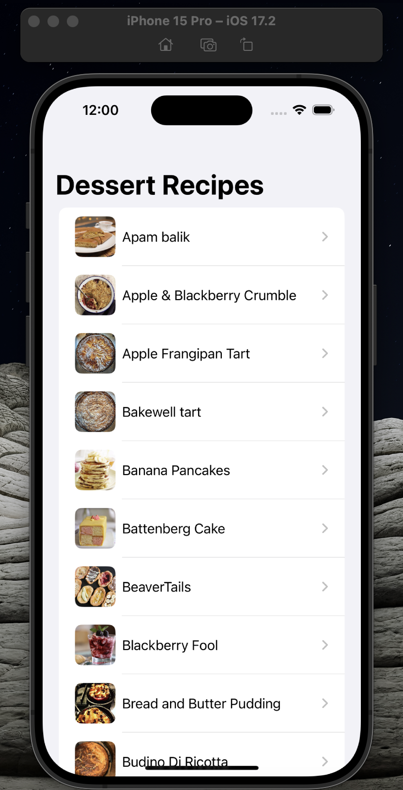

# Fetch - iOS Coding Challenge

## Project Description

This is a native iOS application that allows users to browse recipes using the MealDB API. The app fetches a list of meals in the Dessert category and displays them sorted alphabetically. When a user selects a meal, they are taken to a detail view that includes the meal name, instructions, and ingredients/measurements.

## Tech Stack

- **Programming Language**: Swift
- **Concurrency**: Swift Concurrency (async/await)
- **UI Framework**: UIKit
- **Networking**: URLSession
- **API**: TheMealDB API
- **Development Environment**: Xcode
- **Test Device**: iPhone 15

## APIs Used

- **Get Dessert Meals**: `https://themealdb.com/api/json/v1/1/filter.php?c=Dessert`
- **Get Meal Details by ID**: `https://themealdb.com/api/json/v1/1/lookup.php?i=MEAL_ID`

## Features

- Fetches and displays a list of dessert meals.
- Displays meal details including name, instructions, and ingredients/measurements.
- Filters out any null or empty values from the API before displaying them.
- Utilizes Swift Concurrency for asynchronous code execution.

## Setup Instructions

1. Clone the repository.
2. Open the project in Xcode.
3. Build and run the project on an iPhone 15 simulator or device.

## Screenshots

### Main Screen

### Detail View

## Usage

- Launch the app to see a list of dessert meals.
- Tap on a meal to view its details including name, instructions, and ingredients/measurements.

## License

This project is licensed under the MIT License - see the [LICENSE](LICENSE) file for details.

## Contact

If you have any questions or feedback, feel free to reach out.

---

**Note**: Please replace the placeholder paths for screenshots with actual paths to the images.
